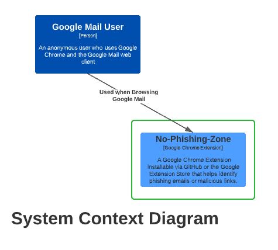
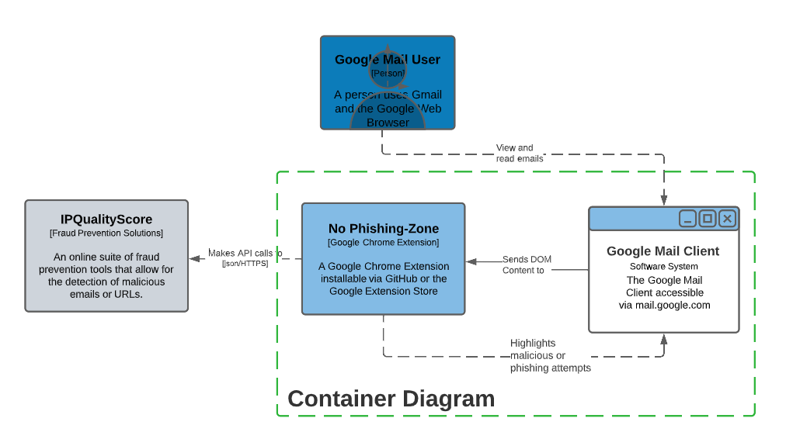

### These are the sections of the final research paper.
## Abstract (Basic research paper abstract and is the Executive Summery).
Phishing, smishing, vishing… these attacks are often among the most simplistic to perform by malicious actors, and yet they can often have the most damaging consequences. Ransomware is on the rise, especially in the COVID-19 pandemic era, but did you know that a huge portion of ransomware attacks start with a simple phish? Most social engineering attacks follow the shotgun approach, meaning the attacker likes to send as many of them as possible in order to get a catch. Between a lack of focus and a lack of security training, the average Joe is unlikely to spot the difference between a fake link and a real one.
In a large business organization, an end-user might be instructed to undergo security awareness training courses to instill safe practices for working in the digital age. But apart from those people, the average person does not receive any kind of training. What if we could bridge this knowledge gap with security awareness tooling?
No-Phishing-Zone is a Google Chrome extension designed to scan for commonly used social engineering tricks and identify suspicious sending domains, language, key triggers, and perform link validation while a user browses the internet. No-Phishing-Zone will flag those suspicious items and notify the user of the malicious intent leaving the option to continue up to the user. Often users are merely trying to live their lives and do things as quickly as possible, so any tool that helps them stay safe is a good one. No-Phishing-Zone is meant to supplement a user’s safe browsing habits and catch suspicious behaviors which may have slipped by them.
The specific goals for No-Phishing-Zone are to deliver a tool that:
•	Assists with spotting suspicious language which may be a social engineering attempt.
•	Assist in vetting links as legitimate or as suspected to be malicious.
•	Very that the sender of the email is not spoofing an address.
•	Increase the overall safe browsing habits of a user, without having the ability to walk them through a cybersecurity training course.
## I. Background
Issue of phishing
- Definition of phishing.
- Brief history of phishing.
## II. Introduction
Framing issue of phishing as a behavioral problem, not entirely a technical one.
- Delay between attack and fallout from attack.
- Attackers’ techniques
•	Different types of attacks, and current state of situation should all be covered.
- How these attacks happen.
	- Why these attacks happen.
	- Genesis of our project idea and why defenses for these attacks are important.
- Impacts we believe this will have in the current situation
Related works
-	Brief recap of literature review.

## III. Methodology
Over the course of the semester our projects scope was toned down due to our initial lack of web development experience and our unfamiliarity of Chrome Extension Development. We initially started out with trying to create a cross browser extension that can ingest the currently open email and identify grammar errors, malicious links, and see if the email came from a malicious sender across multiple web email clients. Upon starting the project we began to realize that creating a cross browser extension would not be feasible due to the semesters time constraint so we opted for a Google Chrome Extension. Similarly we decided that we would not be able to have the extension work across multiple web mail clients do to the obfuscation of `class` and `id` variables and eventually decided upon focusing on creating an extension that works with the Google Mail web client. Due to the difficulty of parsing the Google Mail DOM page we decided against the idea of identifying grammar errors and only focus on the senders email and any URLS in the body. The system context diagram below shows how the average user would interact with our extension. The extension will only execute when a user is inside the `https://mail.google.com/` domain.

### A. Identifying the Emails Sender and Body
The next logical step was to identify the email senders address and all URLS inside the body of the email. To do this we exported a copy of the DOM to a text file and had to manually sort through the HTML code and look for the key elements. We found that Google Mail stores the senders email address under a `` tag with a class of `go`. Attempting to identify the URLs inside the body of the email proved to be a more difficult task. We had to start at a paragraph or known URL in the body and work our way up to the outer most `
` tag while not including the URLs for the Inbox on the side or at the bottom of the webpage. Through a bit of trail and error and outputting different `
` classes or ids to the console we eventually discovered that the `
` tag with an id of `:2h` contained the body of the email. We confirmed with the other members of our team that the `go` class and `:2h` id were the same across accounts, browsers, and sessions before be began parsing the data inside the tags.

### B. Windows Event Listeners
Chrome Extension utilize Content Scripts to execute JavaScript inside the context of a webpage by using the standard Document Object Model (DOM). (source: https://developer.chrome.com/docs/extensions/mv2/content_scripts/) We utilized content scripts to read in the elements from the `DOM` and make changes based on what the element is. Content Scripts rely on window events in order to execute code, so we had to add an event listener to look for `popstate` events since all of the opening of mail inside a mailbox stays within the `https://mail.google.com/mail/u/0/#` URL. We initially used the `load` event listener but discovered that only worked on page refreshes. Since the opening of a new mail does not trigger a `load` event we had to listen for active history entry changes. (source: https://developer.mozilla.org/en-US/docs/Web/API/Window/popstate_event) Due to refreshing the browser not triggering `popstate` event listener we had to keep the `load` listener so we can catch and execute our code on both events.   

### C. Parsing the Email and URLs
Once the event listeners were set up and running we created a function to handle the email address and another function for the list of URLs inside the `content.js` file. Our `ValidateEmail` function took the `` tag with the class `go` and stored the `innerText` of the object in a `String` after stripping off the `<` and `>` characters before attempting to validate it. The URLs are sent to the `ValidateURLS` function where we had to create a `NodeList` of all `a` tags in the URL object. We then looped through each `a` tag in the `NodeList` and attempted to validate.

### D. Allow/Deny List vs API
Our initial plan was to use an allow and deny list of known malicious or known valid domains. We began attempting to build out our lists however we ran into a couple issues finding already created open source lists. Websites like https://PhishTank.com offered ways for users to verify if a link is a known phish but they required an account to access their API and registration was closed. (source: https://www.phishtank.com/) We were able to download a list of known phishing URLs from Phishtank but there were not timestamps showing the last time the list was updated. We were able to register for an API key through ThreatCenter Labs which allowed us to download a `.txt` file of known malicious domains that was said to be updated on a regular basis. (source: https://threatcenter.crdf.fr/) We began developing our extension so it could read in the data from the text files and use the JavaScript `indexOf(index)` function where `index` was the email addresses domain or a URL from the emails body. This method partially worked and we were able to flag potentially malicious domains but several bugs happened where an email address from UPS (ups.com) or RedFin (redfin.com) (which we know are not malicious) were being flagged as malicious because they are not on the allow lists. We would have to manually or programmatically update our allow list to account for new non-malicious domains. Another issue we ran into was the `indexOf(index)` function was producing a large amount of false positives since it checked if `index` was a subset of an known malicious domain on our deny list.  Using redfin.com as an example, `indexOf(index)` would return true since the string redfin is a subset of `freestar-redfin-tagan.adlightning.com` a known malicious domain. Similarly ups.com was being marked as malicious because it is a subset of the string `fuyagroups.com` which was also on our deny list. In order to fix these bugs we would either have to manually add the redfin.com or ups.com domains to the allow list or figure out another way of comparing strings without the use of `indexOf(index)`. Due to these issues, we eventually decided against the use of and allow/deny list and found an API through IPQualityScore that allowed standard users to register for a free account with 200 API calls a day and 5,000 API calls a month. (source: https://www.ipqualityscore.com/) We had to re-design our extension so it can work with an API but the benefits of a real time malicious URL and email validator outweighed the time it took to re-code our extension. We felt the benefits and richness of the APIs response values would help further give the user a more information rich experience when using our extension. The container diagram below shows how our extension interacts with the user, Google Mail client, and the IPQualityScore API.

### E. Validating Senders URL and Email Address
When we began implementing the API we learned that API calls are not allowed inside Content Scripts, we tried using `jsonp`, `XMLHttpReqests`, and `jQuery JSON request` to no avail. Upon further research we learned that the use of a background script was needed in order to communicate with an external API. (source: https://developer.chrome.com/docs/extensions/mv2/background_pages/) We created a `background.js` file that would communicate with our `content.js` file via messages passing, where the `content.js` file would send the email and URL to `bacground.js`, `background.js` makes the API call and sends the response back to the `content.js` file. Background scripts allow for a single listener so we needed to devise a way to pass over a `type` variable that helps distinguish between an email and URL since they go to different APIs. Since Chrome Message passing allows for `json` strings we simply added  `{"type": "type", "pieceToValidate": pieceToValidate}` to the `sendMessage` function where the `type` was either `email` or `URL`. This allowed us to make the appropriate API request and return the appropriate response to the open `listener` in the content script. Since the background script makes the API call we chose to validate the email or URL based on the response inside the background script and send back a `true` or `false` based on the `json` response values. For email we chose to look at whether the email was valid, if it belonged to a temporary or disabled mail server, and the overall mail score according to IPQualityScore API documentation. (source: https://www.ipqualityscore.com/documentation/email-validation/overview) For URLs IPQualityScore offers a similar API response set where we checked to see if the URL was used for phishing, malware, viruses, spam, or if its been parked. (source: https://www.ipqualityscore.com/documentation/malicious-url-scanner-api/overview) Before we send the URL to the background script we had to format it per IPQualityScores API documentation and replace `https://` with `https%3A%2F%2F`. We used the regex `/^https?:\/\//` alongside the replace function to ensure `http` or `https` of all URL strings are replaced before sending the URL off to the background script for the API call. We used the IPQualityScore API responses to determine if a URL or email could be flagged as potentially malicious and we will highlight URL or email red for malicious and green for good. We spent several weeks discussing the different API response we wanted to use without making our extension to strict and flagging everything as potentially malicious. We had to limit the amount of parameters used and rely on the `risk_score` response to ensure we are still providing users with a rich experience. We also appended the Risk Score next to the URL or email to give the user a better understanding of why it was highlighted the way it was. To get a better visual representation of our extension refer to the component diagram below to see how our extension interacts with the external API.

## IV. Results
-	Effectiveness of browser extension.
-	Advantages of using No Phishing Zone.

## V. Future Work and Conclusion
### A. Future Work
The email and URL API endpoints offer more options that a future user could easily implement in our Chrome Extension to provide more of an analysis, to see the full list of supported API response fields refer to the Email API Documentation and URL API Documentation. (source: https://www.ipqualityscore.com/documentation/overview) Future work could expand on what we did by implementing a more robust analysis of an email address or URL. IPQualityScore also offers a reporting feature where users can report malicious URLs or Emails. Future work could implement this reporting feature into the Extension `popup.html` so suspected links can be added to IP IPQualityScores database. Since IPQualityScore offers a full fraud suite of tools with dedicated APIs we could expand on our application and focus on phishing and malicious links across all websites, however the limited amount of API calls offered by IPQualityScore would not be able to support that on the free subscription model. Future researches could build their own database of known malicious domains, similar to what is offered by IPQualityScore, to not be limited by the daily API call limit or further research can be done on other opensource APIs that do not have a daily limit. We were able to find several sites that contained updated lists of known malicious URLs, these lists can be complied into a single allow list and hosted inside the No-Phishing-Zone Chrome Extension folder and updated on a semi-regular basis however this was deemed out of scope for our semester project. Implementing our own allow/deny list would eliminate the reliance on a 3rd parties API, however the richness of the API and responses offered seemed to align with the scope of our semester project.

Due to the timeframe of the semester we had to limit our scope to only focus on Chrome Extensions and the Google Email Web Client. Future work can further develop our Extension and expand support to other web browsers and other email web clients. Due to the obfuscation of the DOM elements that identify the senders email address and the body of the email we were only able to identify the `class` and `ids` for Google Emails. However we were able to verify that these `class` and `ids` are unique to all Gmail accounts across multiple browsers. Future researchers can identify the same unique identifiers and apply support to online mail clients like Outlook or Yahoo. Our extension does not analyze attachments in emails, future work can be done to vet the authenticity of an attachment and see if it is malicious or not. Currently we just rely on the fact that if the email is from a suspicious sender it is assume the attachment is malicious. We also used version 2 of the `manifest.json` due to its support of background pages and more importantly `jQuery` in background pages. Future work would see that the `manifest` version is updated to version 3, however that would require more time since we would have to re-work how our application does API calls in the background page. Manifest version 2 is currently will be end of life (EOL) as of January 2023 (source: https://developer.chrome.com/blog/mv2-transition/).

### B. Conclusion
Insert information for Conclusion Here

## VI. Citations
[x]“Content scripts,” Chrome Developers.  [Online]. Available: https://developer.chrome.com/docs/extensions/mv2/content_scripts/

[x]“Window: popstate event - Web APIs | MDN.”  [Online]. Available: https://developer.mozilla.org/en-US/docs/Web/API/Window/popstate_event

[x]“Fraud Prevention | Bot Detection | Bot Protection | Prevent Fraud with IPQS.”  [Online]. Available: https://www.ipqualityscore.com

[x]“Manage events with background scripts,” Chrome Developers.  [Online]. Available: https://developer.chrome.com/docs/extensions/mv2/background_pages/

[x]IPQualityScore.com, “Email Validation API Documentation | IPQualityScore.com.”  [Online]. Available: https://www.ipqualityscore.com/documentation/email-validation/overview

[x]IPQualityScore.com, "IPQualityScore Homepage | IPQualityScore.com" [Online]. Available: https://www.ipqualityscore.com/documentation/overview

[x]“PhishTank,” PhishTank.  [Online]. Available: https://www.phishtank.com/

[x]“CRDF Threat Center,” CRDF Threat Center API.  [Online]. Available: https://threatcenter.crdf.fr/

[x]IPQualityScore.com, “Malicious URL Scanner API Documentation | IPQualityScore.com.”  [Online]. Available: https://www.ipqualityscore.com/documentation/malicious-url-scanner-api/overview

[x]“The transition of Chrome extensions to Manifest V3,” Chrome Developers. [Online]. Available: https://developer.chrome.com/blog/mv2-transition/
